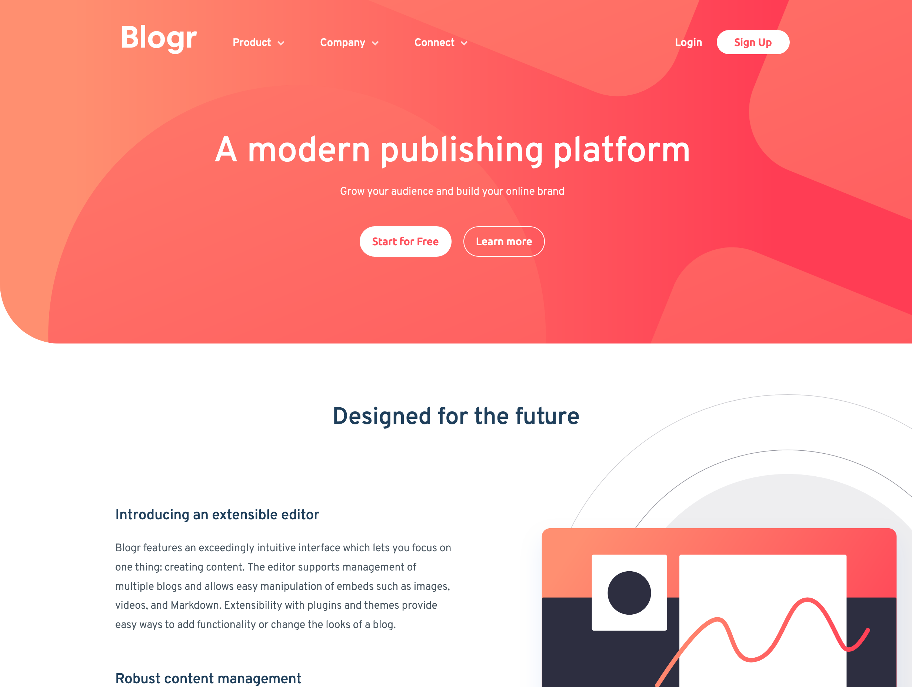

# Frontend Mentor - Blogr landing page solution

This is a solution to the [Blogr landing page challenge on Frontend Mentor](https://www.frontendmentor.io/challenges/blogr-landing-page-EX2RLAApP). Frontend Mentor challenges help you improve your coding skills by building realistic projects. 

## Table of contents

- [Overview](#overview)
  - [The challenge](#the-challenge)
  - [Screenshot](#screenshot)
  - [Links](#links)
- [My process](#my-process)
  - [Built with](#built-with)
  - [What I learned](#what-i-learned)
  - [Continued development](#continued-development)

- [Author](#author)
- [Acknowledgments](#acknowledgments)

## Overview

### The challenge

Users should be able to:

- View the optimal layout for the site depending on their device's screen size
- See hover states for all interactive elements on the page

### Screenshot

### Links

- Solution URL: [Add solution URL here](https://olgak169.github.io/FMBlogrChallenge01/)
- Live Site URL: [Add live site URL here](https://your-live-site-url.com)

## My process
Mobile first using Sass
### Built with

- CSS custom properties
- Flexbox
- CSS Grid
- Mobile-first workflow

### What I learned

I learned that planning ahead will save time in a long run.)

### Continued development

Need to work on the alignment, that was the biggest issue

## Author

- Frontend Mentor - [@yourusername](https://www.frontendmentor.io/profile/olgak169)

## Acknowledgments

This was a fun challenge, so big thanks to Frontend Mentor!
